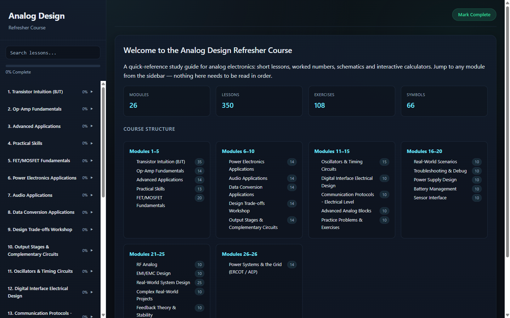
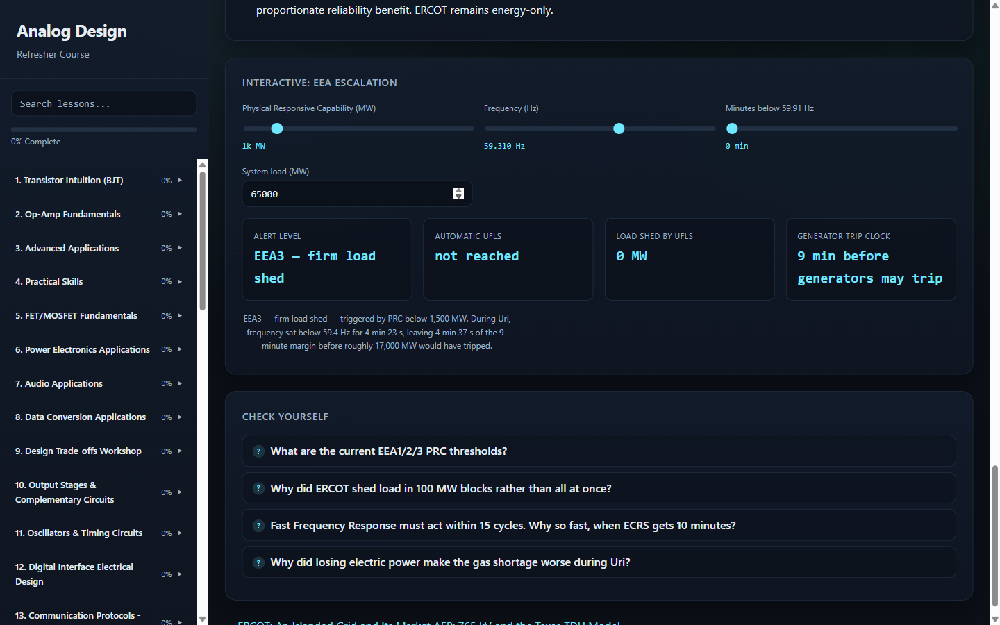
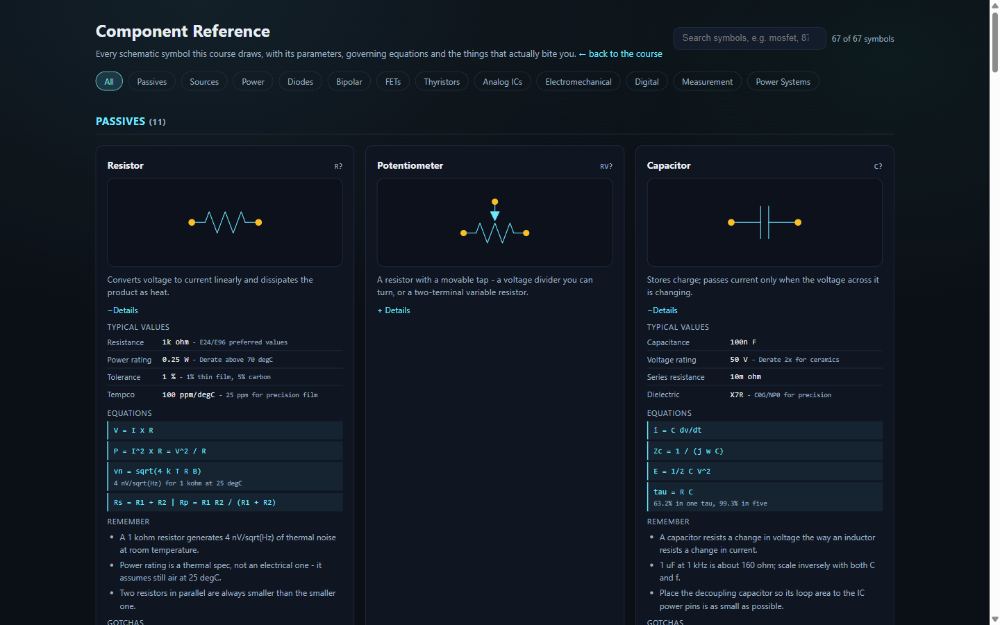

# EE Review — Analog Design & Power Systems Study Guide

A browser-based quick-reference study guide for electrical engineering. **26 modules, 350
lessons**, each one short enough to read in a sitting: the concept, the equations that matter,
a worked example with real numbers, an interactive calculator, and the gotchas that only show
up on a bench or in the field.

It is deliberately **not** a course you work through in order. Open the sidebar, jump to the
thing you need to remember, and leave.



---

## Running it

The lessons are loaded over XHR, so the app needs a web server — opening `index.html`
straight off disk will show a browser-security notice instead of lesson content.

```bash
python -m http.server 8000
# then open http://localhost:8000
```

On Windows, `Launch_EE_Learning.bat` does the same thing and opens a browser for you.

No build step, no dependencies, no `node_modules`. It is plain HTML, CSS and ES5-compatible
JavaScript.

---

## What is in it

| Modules | Subject |
| --- | --- |
| 1–5 | BJT and MOSFET device intuition, op-amp fundamentals, practical skills |
| 6–10 | Power electronics, audio, data conversion, design trade-offs, output stages |
| 11–15 | Oscillators and timing, digital interfacing, comms protocols, analog blocks, practice problems |
| 16–20 | Real-world scenarios, troubleshooting, power supply design, battery management, sensor interfacing |
| 21–25 | RF analog, EMI/EMC, system design, complex projects, feedback theory and stability |
| **26** | **Power systems and the grid (ERCOT / AEP)** |

Module 26 is the newest and the odd one out: undergraduate power-systems theory (per unit,
symmetrical components, the swing equation, power flow) paired with how the Texas grid and a
large US utility actually operate — EEA escalation thresholds, the Winter Storm Uri timeline,
765 kV transmission economics, relay coordination practice, and field safety.



There is also a standalone **[component reference](components.html)** — every schematic symbol
the course draws, with its parameters, governing equations and failure modes, searchable and
filterable by category.



---

## Layout

```
index.html               The application shell and welcome screen
components.html          Searchable symbol + parameter reference
assets/
  ad-framework.js        AD namespace: parsing, waveform generation, DSP, canvas plotting
  component-models.js    Component model catalog — 66 symbols, ported from circuit_toy
  schematic-svg.js       Schematic engine: symbol drawing, DRC, pre-built circuit generators
  schematic-normalize.js Post-render normalisation of hand-written lesson SVGs
  curriculum.js          Curriculum data + AppState, Navigation and Router
  exercises.js           108 exercises across 8 sets and 4 difficulty levels
  widgets.js             Oscilloscope, calculator and exercise widgets
  styles.css             The whole stylesheet
lessons/module-NN/       350 lesson fragments, one HTML file each
tools/                   Headless validators (see Testing)
docs/                    Troubleshooting notes and README images
split_pdfs/              Reference PDFs (see Licensing note below)
```

### How a lesson loads

`Router.loadLesson()` fetches `lessons/module-NN/lesson-NN.html`, injects it into
`#lesson-content`, and re-creates its `<script>` tags so they execute. Four things happen
around that injection, all of them there because lessons were originally authored as
standalone pages:

1. **External scripts load at most once.** A lesson that carries its own
   `<script src="../../assets/ad-framework.js">` would otherwise redeclare `const AD` and throw
   `SyntaxError: Identifier 'AD' has already been declared`, killing the rest of that tag.
2. **Each lesson's inline script is wrapped in a function scope,** with its top-level functions
   re-published on `window` so inline `onclick=` handlers still resolve. Without this, two
   lessons that both declare `const canvas` collide the moment you navigate between them.
3. **`DOMContentLoaded` and `load` handlers are redirected to run on the next tick.** Both
   events fired long before the fragment existed, so lessons that defer their setup to them
   would never initialise at all.
4. **Timers are scoped to the lesson.** Every `setInterval`, `setTimeout` and
   `requestAnimationFrame` is tagged with a navigation generation and cancelled when you move
   on, so animation loops do not keep firing against a DOM that no longer contains their canvas.

If you add a lesson, you do not need to think about any of this — write it as a fragment and
it works.

---

## The component model catalog

`assets/component-models.js` is the single source of truth for schematic symbols. It holds
**66 components across 12 categories**, each carrying geometry, electrical parameters,
governing equations, and study notes.

The models are ported from the component system in **circuit_toy**, a C/SDL2 circuit simulator
in a sibling project. Its registry defines 125 component types grouped by a `PaletteCategoryID`
enum; the `toy:` field on each model here records the matching `COMP_*` name so the two
catalogs can be diffed.

**The two projects render very differently, and the geometry reflects that:**

| circuit_toy | EE Review |
| --- | --- |
| Immediate-mode SDL2, redrawn every frame at 60 fps | Static SVG, emitted once and scaled by the browser |
| Symbols in device pixels at the current zoom | Symbols in a local frame, placed by transform |
| Animated — current arrows move, hot nodes glow, probes update live | Nothing animates; the frozen symbol carries all the information |
| Correctness proven by running the MNA solver | Correctness proven by the DRC: keepouts, pin registry, text collision |
| Purpose: play with a live circuit | Purpose: recognise a symbol and recall its equations in seconds |

Practical consequences: polarity marks and arrows are drawn slightly larger here because they
are never disambiguated by watching current flow; strokes use
`vector-effect="non-scaling-stroke"` so they stay legible at any zoom; and every symbol declares
an explicit keepout and pin escape direction so the router can work around it.

circuit_toy's solver detail was deliberately **not** ported — the theta-method companion models,
`GMIN`, the Newton loop — because this project does not simulate. Several of its models are also
acknowledged stubs (SCR and TRIAC never latch; DAC/ADC/VCO/PLL emit a fixed 2.5 V; the varactor
and photodiode share a plain diode stamp), so the electrical descriptions here were written from
device physics and datasheets rather than copied from those stamps.

### Using it

```js
ComponentModels.get('nmos')                    // the model object
ComponentModels.symbolSVG('nmos', {width: 150}) // a standalone <svg> string
ComponentModels.draw('nmos', {x, y, rotate})    // {markup, pins, keepout}
ComponentModels.diagram({parts, wires, texts})  // a complete one-line diagram
ComponentModels.byCategory()                    // {category: [model, ...]}
ComponentModels.validate()                      // catalog self-check
```

Coordinates are local pixels with the origin at the body centre. A standard two-terminal part is
50 px long with pins at (−25, 0) and (+25, 0), matching `COMP_LENGTH = 50` and `GRID = 5` in
`schematic-svg.js` — so a model placed on a grid point keeps its pins on grid.
`ComponentModels.validate()` enforces that, along with pin uniqueness and direction validity.

---

## Testing

```bash
node tools/validate-schematics.js --all    # schematic DRC over factories and lessons
node tools/find-schematic-issues.js        # heuristic scan for floating labels/grounds
node tools/test-all-canvases.js            # canvas smoke test  (see caveat below)
```

`validate-schematics.js --all` currently reports **0 warnings and 0 errors**.

> **Caveat on `test-all-canvases.js`:** it simulates a browser with Node's `vm` module and
> produces false negatives — it reported 106 lessons with "empty canvases" that paint correctly
> in a real browser. Verify anything it flags by opening the lesson and checking
> `getImageData` on the canvas, rather than trusting the harness.

### Browser smoke test

The most useful check is driving the real app. This walks every lesson, exercises every control
across its full range plus out-of-range values, and reports JavaScript errors, `NaN`/`Infinity`
leaking into the output, and canvases that never painted. Paste into DevTools with the app open:

```js
for (const m of CURRICULUM.modules) {
  for (const l of m.lessons) {
    Router.loadLesson(m.id, l.id);
    await new Promise(r => setTimeout(r, 200));
    const root = document.getElementById('lesson-content');
    for (const c of root.querySelectorAll('input[type=range],input[type=number],select')) {
      const lo = parseFloat(c.min) || 0, hi = parseFloat(c.max) || 100;
      for (const v of [lo, hi, (lo + hi) / 2, lo - hi, hi * 2, '']) {
        c.value = v;
        c.dispatchEvent(new Event('input', { bubbles: true }));
      }
    }
    if (/(^|[\s>:=(])(NaN|Infinity)\b/.test(root.innerText)) console.warn(m.id + '-' + l.id);
  }
}
```

Latest run: **350 lessons, 2,430 controls, 470 canvases, zero JavaScript errors.** Four lessons
(7-5, 24-3, 25-3, 25-4) can still display `NaN` under deliberately out-of-range input, and one
canvas (`identify-topology-canvas` in 25-2) has no drawing code behind it at all.

---

## Notes for contributors

**Reading inputs.** Use `AD.num('element-id')`, never `parseFloat(el.value)`. `AD.num` falls
back to the field's default when it is blank or unparseable, and clamps to the element's
`min`/`max`. That is what stops a cleared box from rendering `NaN` in the results panel and a
negative resistance from producing infinite gain.

**Formatting.** `AD.fmt(x)` renders engineering notation and already returns `—` for anything
non-finite. `AD.fmtUnit(x, 'Ω')` appends a unit.

**Schematics.** Prefer `ComponentModels` for new diagrams. `SCHEMATIC_METHODOLOGY.md` documents
the layout rules the DRC enforces: orthogonal routing only, junction dots at any node of degree
≥ 3, no 4-way junctions, pin escape of at least one grid unit, and no text overlapping wires or
keepouts.

**Adding a lesson.** Drop the fragment in `lessons/module-NN/`, then add a matching entry to
`assets/curriculum.js`. The welcome screen counts and the sidebar are generated from that array,
so a file without an entry exists on disk but is unreachable — which is exactly how 16 lessons
went missing before.

---

## A note on `split_pdfs/`

The reference PDFs (*The Art of Electronics*, the *Analog Pocket Reference*, TI's *Analog
Engineer's Circuit Cookbook*) are third-party copyrighted works and are **not** licensed for
redistribution.

They were **removed from git history on 2026-08-31** with `git filter-repo`, and `split_pdfs/`
is now in `.gitignore`. Keep your own copies locally if you want them — nothing in the
application reads them at runtime, so the app works without the directory present.

The `split_pdfs.py`, `resplit_pdfs.py` and `split_analog_ref.py` scripts remain, so you can
regenerate the split files from your own copies of the source documents.

---

## Acknowledgements

Component models adapted from the [circuit_toy](https://github.com/jfalvarez1/circuit_toy)
simulator. Power-systems content draws on ERCOT Nodal Operating Guides and Planning Guide,
the FERC/NERC staff report on the February 2021 cold weather outages, NERC reliability
standards, the AEP 2024 Factbook, and IEEE standards C37.112, C57.13, 80, 1366 and 1584.
Figures quoted in Module 26 are cited in the lessons themselves; treat them as a study aid, not
as a design authority.
